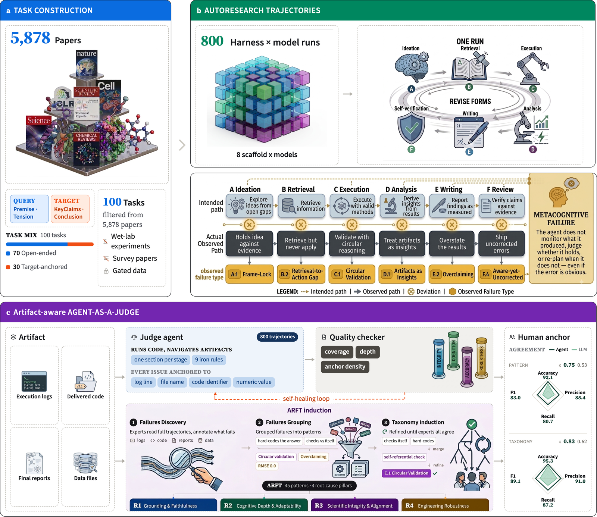

<h1 align="center">AutoResearchEval</h1>

<p align="center">
  <b>How Do Agents Fail on AutoResearch?</b><br/>
  End-to-End Diagnostic Evaluation on 100 Real-World Frontier Research Tasks
</p>

<p align="center">
  <a href="https://arxiv.org/abs/2608.14905"><b>Paper</b></a> ·
  <a href="https://titanresearchlabs.github.io/AutoResearchEval-site/"><b>Website</b></a> ·
  <a href="#citation"><b>Citation</b></a>
</p>

<p align="center">
  
  
  
  
  
</p>

*AutoResearch* is the paradigm where one LLM agent carries a study end to end — hypothesis,
literature, experiment, analysis, write-up. Endpoint scoring tells you whether the final answer
matched a reference; it does not tell you how the agent worked or where it broke.

**AutoResearchEval** is a diagnostic study of that gap. It builds **100 tasks** from published
frontier science across **seven domains**, runs each one as an autonomous six-stage rollout under
**eight harness–model combinations** (**800 trajectories**), and annotates every trajectory at the
*process* level — against the artifacts it produced, not just its report. The annotations are
organized by **ARFT**, the AutoResearch Failure Taxonomy: **45 empirically-grounded failure
patterns** on two axes (lifecycle stage × root cause). Failures appear at every stage but converge
on one limitation: agents lack a **metacognitive loop** — the ability to check what they produced
against what they found, revise when it does not hold up, and question whether the path they took
was sound.

## The study in one figure



| | Stage | What happens |
|---|---|---|
| **a** | **Task construction** | 5,878 candidate papers across nine fields → 100 tasks in seven domains. Each paper is parsed into seven fields; the agent is shown only the query (`Premise`, `Tension`), while the target (`KeyClaims`, `Conclusion`) is withheld. No method is given, so many paths are admissible and none is *the* reference path. |
| **b** | **Rollout** | Each task runs once per harness–model pair as a six-stage episode with revision: 800 trajectories, 73k tool calls, 92.3 steps per episode on average, all artifacts retained. |
| **c** | **Diagnosis** | ARFT is induced bottom-up — three experts annotate full trajectories, group them, and refine to consensus (κ = 0.85 after five rounds) → 45 patterns under 4 root-cause pillars. A judge agent then reviews the whole artifact set under a per-stage rubric, anchoring each issue to concrete evidence, with a quality checker regenerating weak analyses. |

Two task types are reported separately and never compared: **open-ended discovery** (*n* = 70; no
metric exists, so the process is what is judged) and **target-anchored optimization** (*n* = 30;
an explicit human SOTA or computable metric exists).

The eight agents — one harness supplies the tool loop, file system, and code execution; the
backbone model drives it:

| Harness | Backbone models |
|---|---|
| Claude Code | opus-4.8, claude-sonnet-5, qwen3.7-max, glm-5.2, minimax-m3, deepseek-v4-pro |
| Codex | gpt-5-mini |
| Gemini CLI | gemini-3.5-flash |

## What is in this repository

The study has three moving parts — **build the tasks**, **run the agents**, **diagnose the
trajectories**. This repository is the code for the first and the third.

```
papers ──▶ [ this repo: task construction ] ──▶ tasks ──▶ [ container rollouts: NOT here ]
                                                              │
                                            trajectories ◀────┘
                                                  │
                                                  ▼
                                     [ this repo: agent-as-a-judge ] ──▶ analysis.md ──▶ ARFT labels
```

**1 · Task construction** — papers in, runnable task directories out (panel **a**).

| Path | What it does |
|---|---|
| `adapters/openalex.py` | OpenAlex metadata + automatic bronze/silver/golden tiering of candidate papers |
| `adapters/paper_corpus.py` | reads a MinerU-parsed PDF corpus into section-sliced text |
| `reconstruct/discovery_pattern.py` | the seven-field extraction pass + novelty-move label (this is the prompt printed in the paper's appendix) |
| `reconstruct/paper_gt.py` | parses the paper's reported numbers into the held-out gold |
| `reconstruct/llm_openrouter.py` | OpenRouter client for the extraction/teacher calls |
| `examples/` | the drivers that chain the above: crawl → fetch → mine → export → materialize |

**2 · Diagnosis** — trajectories in, ARFT labels out (panel **c**).

| Path | What it does |
|---|---|
| `agent-as-a-judge/generate/` | Stage 1 — one fresh Claude Code session per trajectory writes `analysis.md`, a six-stage critique with claim-by-claim verdicts, plus a quality checker |
| `agent-as-a-judge/classify/` | Stage 2 — `analysis.md` → ARFT pattern IDs, pattern × model matrices, root-cause rollups, agreement stats |
| `agent-as-a-judge/classify/arft_patterns.py` | the 45-pattern label space (source of truth) |
| `agent-as-a-judge/classify/arft_guide.md` | the operational guide handed to the classifier |

Full details: [`agent-as-a-judge/README.md`](agent-as-a-judge/README.md).

**3 · Scoring and reference-domain scaffolding.** The remaining directories are the machinery the
task-construction line grew out of. They are useful if you want to extend the task suite with a
new scored domain, and unnecessary if you only want to reproduce the diagnosis.

| Path | What it does |
|---|---|
| `harness/discovery_verifier.py` | the rubric scorer behind the `reward` / `conclusion_match` / `soft[<observable>]` fields quoted in the paper's case studies |
| `harness/discovery_env.py` | domain-agnostic discovery episode skeleton (FRAME → DESIGN → EXECUTE → RESOLVE); imports no chemistry |
| `harness/domains/catalysis_qe.py`, `harness/co_pt_oracle.py`, `harness/recompute_tools.py`, `verify/mlip_prefilter.py` | computational catalysis as the one worked example of a live recompute oracle (Quantum ESPRESSO / MLIP) |
| `ir/`, `export/` | trajectory IR, typed action registries, SFT/ReAct export with loss masking |

### Not in this repository

- **The rollout infrastructure** (panel **b**). Rollouts ran as one Docker container per
  model–task on a SLURM node (8×B300, 32 cores and 150 GB per container, 4 h wall clock), driving
  Claude Code / Codex / Gemini CLI against models served through OpenRouter. That orchestration is
  not part of this release.
- **The task suite and the annotated corpus.** The 100 tasks and the 800 trajectories with their
  process-level annotations are released as data, separately from this code.
- **Keys, credentials, model weights.** None are included; see [Environment variables](#environment-variables).

## Setup

```bash
pip install -r requirements.lock          # pinned, verified-importable versions
export OPENROUTER_API_KEY=...             # teacher LLM for extraction; never commit keys
```

Core deps are `pydantic` only, so the IR / export / verify core imports without a
scientific-computing stack. Heavy per-source deps are extras:

```bash
pip install -e ".[aiida]"        # AiiDA provenance adapter
pip install -e ".[mlip]"         # MACE / CHGNet / M3GNet prefilter
pip install -e ".[atomate2,mp]"  # atomate2 TaskDocs, Materials Project
```

`requirements.freeze.txt` is the full 226-package freeze of the verified environment.
`agent-as-a-judge/` installs separately (`httpx`, `pandas`) and needs an authenticated `claude`
CLI for Stage 1.

## Pipeline 1 — papers to tasks

### Crawl and grade a corpus

Tiering is automatic from OpenAlex signals — no hand-curated whitelist: **bronze** (breadth),
**silver** (the workhorse for extraction), **golden** (elite venue *and* field-leading impact,
weighted up downstream). Recent papers are graded on venue and institution; citations only ever
promote, so a 2026 paper is never punished for having no citations yet.

```bash
python examples/crawl_topic_set.py --per-topic 60 --set-name diverse_v1
python examples/fetch_corpus_pdfs.py --set diverse_v1 --unpaywall --s2 --core
```

### Extract the seven fields

One LLM pass per paper returns the seven fields, the key claims, and one novelty-move label
(`consensus-overturn`, `method-correction`, `new-regime`, `mechanism`, `scaling-relation`,
`reconciliation`, `incremental`). It is a reconstruction, not an evaluation: the model reports
what the paper states and never invents numbers.

```bash
python examples/discovery_pattern_mine.py --zip corpus.zip     # -> one record per paper
```

Each field has a job. **Premise** and **Tension** become the agent's query. **KeyClaims** and
**Conclusion** are withheld as gold. **Experiment** and **Method** gate whether a paper can become
a runnable task at all — a purely wet-lab experiment or a single-step lookup is dropped.
**Motivation** and **Conclusion** decide whether the task is *open-ended discovery* or
*target-anchored optimization*.

### Materialize task directories

```bash
python examples/export_discovery_tasks.py          # -> discovery_tasks.jsonl
python examples/materialize_discovery_tasks.py \
    --jsonl examples/output/discovery_tasks.jsonl \
    --template path/to/env_template \
    --out examples/output/discovery_tasks_v6 --prompt-version v6_report_review
```

`--template` points at a directory holding `environment/Dockerfile`, copied into every task.
Each task directory holds `instruction.md` (premise + tension, an open decision schema, **no gold
leaked**), a `task.toml`, and the per-paper rubric the verifier scores against.

`instruction.md` is what carries the six-stage process the agent is asked to work through:
**A** Ideation & Planning → **B** Retrieval & Synthesis → **C** Execution & Implementation →
**D** Analysis & Interpretation → **E** Writing & Documentation → **F** Self-Verification & Review.
Six wordings live side by side in `PROMPT_VERSIONS` so they can be A/B'd on an identical task set;
each one's rationale is recorded in the comment above it.

| `--prompt-version` | |
|---|---|
| `v6_report_review` | **the prompt used for the paper's 800 rollouts**, reproduced in the appendix: `decision.json` first, then a narrative `report.md` with a `## Peer Review` section |
| `v5_report_review` | same ordering fix, no peer-review section |
| `v4_report_review`, `v3_failure_taxonomy` | intermediate: added `process_log`, then `report.md` |
| `v2_af` | domain-general six-stage prompt, no `process_log` (the script's default) |
| `v1_domain_specific` | original chemistry/materials wording, no explicit process structure |

## Pipeline 2 — trajectories to ARFT labels

Many failures leave no trace in the report — a result the code never produced, a method the logs
never ran — so catching them means checking the manuscript against the artifacts. The judge is
therefore **artifact-aware**: a fresh, zero-history Claude Code session per trajectory, with shell
access and no network, handed the full evidence package (task statement, execution log, delivered
filesystem, the scorer's own source, every scoring call, read-only gold) and required to anchor
every finding to a line, file, or value.

Against three-expert annotation on 50 stratified trajectories it reaches **κ = 0.75** (pattern)
and **0.83** (root cause), versus 0.53 / 0.62 for a single-call LLM-as-a-judge on the transcript
alone. Almost all of the gain is recall — which is the point: artifact access is what makes
transcript-invisible failures detectable.

```bash
# Stage 1 — trajectory -> analysis.md (six-stage critique, claim-by-claim verdicts)
cd agent-as-a-judge/generate/
python3 generate_analysis_cc.py --run-dir /path/to/your_model__your_suite \
    --concurrency 4 --resume --model claude-opus-4-8

# Stage 2 — analysis.md -> ARFT labels, matrices, root-cause rollups
cd ../classify/
export ARFT_OPENROUTER_KEY=...
./run_all_arft_api.sh        # self-healing: resumes, retries QA failures
python3 arft_verify.py       # polarity regression + cross-run Cohen's kappa
```

`traj_tools.py` normalizes three log formats (Claude Code stream-JSON, Gemini CLI NDJSON, Codex
CLI JSONL), so multi-megabyte logs need no truncation. A checker enforces coverage, depth, and
anchor density; documents that fail regenerate with gate-specific feedback.

## ARFT — the label space

45 patterns on two axes: the **stage** where a failure surfaces, and the **root cause** of why it
happens. Every pattern maps to exactly one pillar.

| Root-cause pillar | Core failure focus | Patterns | Share of hits |
|---|---|---|---|
| **R1 · Grounding & Faithfulness** | Claims disconnect from the code, data, logs, or literature that should license them | A.6, B.1, B.2, B.5, C.3, D.1, D.4, D.6, E.1, E.4, F.6, X.6 | 31.0% |
| **R2 · Cognitive Depth & Adaptability** | Shallow reasoning and search, passive self-critique, inability to re-plan | A.1, A.3, B.4, B.6, C.6, C.7, D.5, F.1–F.4, X.3, X.7 | 27.6% |
| **R3 · Scientific Integrity & Alignment** | Metric hacking, shortcut reliance, concealed failure, conclusions fixed in advance | A.2, A.5, C.1, C.2, D.2, D.3, D.7, E.2, E.3, F.5, X.2, X.4, X.5 | 33.5% |
| **R4 · Engineering Robustness** | Numerical faults, unhandled runtime errors, broken CLI/OS interaction | A.4, B.3, C.4, C.5, C.8, X.1, X.8 | 7.9% |

Stages: **A** Ideation (6 patterns) · **B** Retrieval (6) · **C** Execution (8) · **D** Analysis
(7) · **E** Writing (4) · **F** Review (6) · **X** Cross-stage (8).

Auditing all 800 trajectories yields 12,712 hits. The three cognitive pillars account for 92.1% of
them; engineering robustness for 7.9%. The single most frequent pattern is **F.4 · Uncorrected
Self-Awareness** — the agent identifies a severe flaw during its own review and ships anyway — in
82.5% of analyses. The evidence that would refute most failures is already sitting in the agent's
own run directory; the comparison is simply never performed.

## Scoring scaffolding and the catalysis reference domain

This is group 3 above — read it if you want to extend the suite with a new scored domain, skip it
if you only want to reproduce the diagnosis.

Open-ended tasks expose no objective and are judged on process. Where a task does have a metric,
the terminal reward is a gate, not a weighted sum:

```
reward = correctness × (0.5 + 0.25·significance + 0.25·novelty)
```

`correctness ∈ {0,1}` is a re-executed number matching the held-out gold within tolerance. Wrong
or un-run scores **0**, so the soft dimensions only *rank* rollouts that already passed. The
episode gate has the same shape — `sane ∧ decisive ∧ valid`, not "produced a number".

`harness/discovery_env.py` imports no chemistry at all: the skeleton (frame a tension → design an
experiment → read the result → decide if it is resolved) is domain-agnostic, and catalysis is the
first plugin (`harness/domains/catalysis_qe.py`). Adding a second domain means a new oracle, not a
new driver. Three recompute tiers are wired up behind `examples/discovery_rollout.py`:

| Tier | What it is | Admissible? |
|---|---|---|
| `emt` | instant EMT — plumbing / CI only | never (physically meaningless) |
| `mlip` | CHGNet universal MLIP — cheap prefilter | no (not the honest reward) |
| `qe` | real Quantum ESPRESSO 7.5 PBE-PAW | **yes** — minutes per calc, MPI |

```bash
python examples/discovery_rollout.py --calc emt              # validate the loop, instant
QE_NP=32 QE_NPOOL=4 python examples/discovery_rollout.py --calc qe   # real DFT, admissible
```

Two invariants are enforced in data rather than prose:

- **Nothing is verified until an execution check says so.** `Trajectory.is_admissible()` returns
  `verification.passed`; export refuses the rest.
- **Failure branches are kept.** A non-zero exit or a correction is flagged
  `is_failure_branch=True` and retained as error→recovery supervision in the SFT export.

### Action vocabulary

Two registries under `ir/actions/`, induced from data (143 GitHub science agents + real provenance
diffs) rather than designed top-down:

- **`registry.json`** — 26 verifier-bound *execution* actions across 11 categories
  (`build_structure`, `run_dft`, `check_convergence`, `triage_failure`, `train_mlip`, …). Each
  pins a verifier this repo owns: external tools supply the action space, verification is ours.
- **`discovery_registry.json`** — 10 atomic *reasoning* moves in three phases (FRAME → PROBE →
  RESOLVE): `survey_consensus`, `identify_tension`, `formulate_question`, `propose_hypothesis`,
  `select_system`, `choose_method`, `run_calculation`, `compare_reference`, `interpret_result`,
  `draw_conclusion`.

## Environment variables

| Variable | Used by |
|---|---|
| `OPENROUTER_API_KEY` | teacher LLM for field extraction and move generation |
| `ARFT_OPENROUTER_KEY` | agent-as-a-judge Stage 2 classifier |
| `AAJ_CORPUS_DIR`, `AAJ_OUT_DIR` | agent-as-a-judge corpus and results roots |
| `OPENALEX_API_KEY`, `S2_API_KEY`, `CORE_API_KEY` | corpus crawl and PDF fallback chain (optional) |
| `QE_PW`, `QE_MPIRUN`, `QE_PSEUDO_DIR`, `QE_NP`, `QE_NPOOL` | Quantum ESPRESSO recompute oracle |
| `MLIP_DEVICE`, `RECOMPUTE_WORKERS` | MLIP prefilter / recompute parallelism |

Keys resolve as: explicit argument → environment → a gitignored `.env` in the repo root.

## Citation

The overview figure in `assets/` is the paper's own.

```bibtex
@article{fei2026autoresearcheval,
  title   = {How Do Agents Fail on AutoResearch: End-to-End Diagnostic Evaluation
             on 100 Real-World Frontier Research Tasks},
  author  = {Fei, Yanlin and Liu, Nazhou and Yu, Xinmiao and Chen, Shaolong and
             Li, Lei and Thapa, Rahul and Ciobanu, Madalina and Mao, Qingqing and
             Das, Ritankar},
  journal = {arXiv preprint arXiv:2608.14905},
  year    = {2026}
}
```

## License

`agent-as-a-judge/` is MIT — see [`agent-as-a-judge/LICENSE`](agent-as-a-judge/LICENSE).
