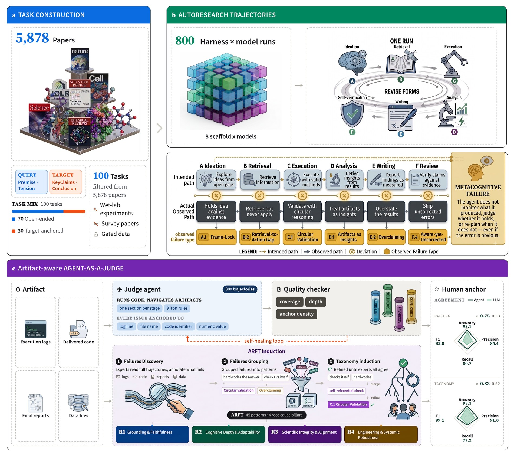

<h1 align="center">AutoResearchEval</h1>

<p align="center">
  <b>How do Agents Fail on AutoResearch?</b><br/>
  End-to-end diagnostic evaluation on 100 real-world frontier research tasks.
</p>

<p align="center">
  
  
  
  
  
</p>

This repository holds the code behind **AutoResearchEval** — a benchmark and diagnostic study of
*AutoResearch*: LLM agents that carry a study end to end, from hypothesis to written report.

Endpoint scoring says whether a run matched a reference, not how the agent worked or where it
broke. AutoResearchEval builds **100 tasks** from published frontier science across **seven
domains** and the full research lifecycle, runs them as autonomous six-stage rollouts under
**eight harness–model combinations** (**800 trajectories**), and annotates each trajectory at the
process level against **ARFT** — the AutoResearch Failure Taxonomy, **45 empirically-grounded
failure patterns**. Failures span every stage but converge on one limitation: agents lack a
**metacognitive loop**.

## Overview



**a — Task construction.** 5,878 candidate papers → seven fields → 100 tasks in seven domains.
The agent sees only the query (Premise, Tension); the target (KeyClaims, Conclusion) is withheld,
so many paths are admissible and none is the reference path.

**b — Rollout.** Each task runs once per harness–model pair as a six-stage episode with revision:
800 trajectories, all artifacts retained.

**c — Diagnosis.** ARFT is induced bottom-up — experts annotate full trajectories, group them,
refine to consensus: 45 patterns under 4 root-cause pillars. A judge agent then reviews the whole
artifact set under a per-stage rubric, anchoring each issue to concrete evidence, with a quality
checker regenerating weak analyses.

## What is in this repository

| Directory | Paper component |
|---|---|
| `adapters/` | source ingestion — OpenAlex metadata + bronze/silver/golden tiering, MinerU paper corpus |
| `reconstruct/` | seven-field extraction, novelty-move labels, OpenRouter teacher client, held-out gold |
| `examples/` | pipeline entry points — crawl → mine → export → materialize → roll out |
| `harness/` | rollout environment, recompute oracle, reward verifier, catalysis-QE plugin |
| `ir/`, `export/` | trajectory IR + typed action registries; SFT/ReAct export with loss masking |
| `verify/` | MLIP pre-filter physics checks |
| `agent-as-a-judge/` | trajectory → `analysis.md` → ARFT ([README](agent-as-a-judge/README.md)) |

The task suite and the 800-trajectory annotated corpus ship separately; this repo is the pipeline
behind them. No API keys, data, or model weights are included.

## Setup

```bash
pip install -r requirements.lock          # pinned, verified-importable versions
export OPENROUTER_API_KEY=...             # teacher LLM; never commit keys
```

Core deps are `pydantic` only, so the IR / export / verify core imports without a
scientific-computing stack. Heavy per-source deps are extras:

```bash
pip install -e ".[aiida]"        # AiiDA provenance adapter
pip install -e ".[mlip]"         # MACE / CHGNet / M3GNet prefilter
pip install -e ".[atomate2,mp]"  # atomate2 TaskDocs, Materials Project
```

`requirements.freeze.txt` is the full 226-package freeze of the verified environment.
`agent-as-a-judge/` installs separately (`httpx`, `pandas`) and needs an authenticated `claude`
CLI for Stage 1.

## Building tasks from papers

Crawl and grade a corpus. Tiering is automatic from OpenAlex signals — no hand-curated whitelist:
**bronze** (breadth), **silver** (the workhorse for extraction), **golden** (elite venue *and*
field-leading impact, weighted up downstream). Recent papers are graded on venue and institution;
citations only ever promote.

```bash
python examples/crawl_topic_set.py --per-topic 60 --set-name diverse_v1
python examples/fetch_corpus_pdfs.py --set diverse_v1 --unpaywall --s2 --core
python examples/discovery_pattern_mine.py --zip corpus.zip     # -> seven fields per paper
```

Extraction emits the seven fields plus the novelty move. **Premise** and **Tension** become the
agent's query; **KeyClaims** and **Conclusion** are withheld as gold; **Motivation**, **Method**,
and **Experiment** decide whether a paper can become a runnable task and whether it is
*open-ended discovery* or *target-anchored optimization*.

```bash
python examples/export_discovery_tasks.py          # -> discovery_tasks.jsonl
python examples/materialize_discovery_tasks.py \
    --jsonl examples/output/discovery_tasks.jsonl \
    --out examples/output/discovery_tasks_v2 --prompt-version v2_af
```

Each task directory holds `instruction.md` (premise + tension, open decision schema, **no gold
leaked**), a `task.toml`, and the per-paper rubric the verifier scores against. `v2_af` is the
domain-general prompt carrying the six-stage process — **A** Ideation → **B** Retrieval →
**C** Execution → **D** Analysis → **E** Writing → **F** Review; `v1_domain_specific` stays
alongside for A/B on the identical task set.

## Rewards for target-anchored optimization tasks

Open-ended tasks expose no objective and are judged on process. Target-anchored tasks have an
explicit metric, so the terminal reward can be a real calculation:

```bash
python examples/discovery_rollout.py --calc emt              # validate the loop, instant
QE_NP=32 QE_NPOOL=4 python examples/discovery_rollout.py --calc qe   # real DFT, admissible
```

| Tier | What it is | Admissible? |
|---|---|---|
| `emt` | instant EMT — plumbing / CI only | never (physically meaningless) |
| `mlip` | CHGNet universal MLIP — cheap prefilter | no (not the honest reward) |
| `qe` | real Quantum ESPRESSO 7.5 PBE-PAW | **yes** — minutes per calc, MPI |

The reward is a gate, not a weighted sum:

```
reward = correctness × (0.5 + 0.25·significance + 0.25·novelty)
```

`correctness ∈ {0,1}` is a re-executed number matching the held-out gold within tolerance. Wrong
or un-run scores **0**, so the soft dimensions only *rank* rollouts that already passed. The
episode gate has the same shape: `sane ∧ decisive ∧ valid`, not "produced a number".

Two further invariants are data, not prose:

- **Nothing is verified until an execution check says so.** `Trajectory.is_admissible()` returns
  `verification.passed`; export refuses the rest.
- **Failure branches are kept.** A non-zero exit or a correction is flagged
  `is_failure_branch=True` and retained as error→recovery supervision in the SFT export.

`harness/discovery_env.py` imports no chemistry at all — the skeleton (frame a tension → design an
experiment → read the result → decide if it is resolved) is domain-agnostic. Catalysis is the
first plugin (`harness/domains/catalysis_qe.py`); a second domain means a new oracle, not a new
driver.

## Agent-as-a-judge

Many failures leave no trace in the report — a result the code never produced, a method the logs
never ran — so catching them means checking the manuscript against the artifacts. The judge is
therefore **artifact-aware**: a fresh, zero-history Claude Code session per trajectory, shell
access, no network, handed the full evidence package (task statement, execution log, delivered
filesystem, the scorer's source, every scoring call, read-only gold) and required to anchor every
finding to a line, file, or value. Against three-expert annotation it reaches **κ = 0.75**
(pattern) and **0.83** (root cause), versus 0.53 / 0.62 for a single-call LLM-as-a-judge on the
transcript — almost all of the gain is recall.

```bash
# Stage 1 — trajectory -> analysis.md (six-stage critique, claim-by-claim verdicts)
cd agent-as-a-judge/generate/
python3 generate_analysis_cc.py --run-dir /path/to/your_model__your_suite \
    --concurrency 4 --resume --model claude-opus-4-8

# Stage 2 — analysis.md -> ARFT labels, matrices, root-cause rollups
cd ../classify/
export ARFT_OPENROUTER_KEY=...
./run_all_arft_api.sh        # self-healing: resumes, retries QA failures
python3 arft_verify.py       # polarity regression + cross-run Cohen's κ
```

`traj_tools.py` normalizes three log formats (Claude Code stream-JSON, Gemini CLI NDJSON, Codex
CLI JSONL), so multi-megabyte logs need no truncation. A checker enforces coverage, depth, and
anchor density; documents that fail regenerate with gate-specific feedback. Rubric, iron rules,
cost, and outputs: [`agent-as-a-judge/README.md`](agent-as-a-judge/README.md).

### ARFT, the label space

Stage 2's label space lives in `agent-as-a-judge/classify/arft_patterns.py` (the code list) and
`arft_guide.md` (the classifier's operational guide). Its 45 patterns sit on two axes — the
**stage** where a failure surfaces, and the **root cause** of why it happens:

| Root-cause pillar | Core failure focus | Patterns |
|---|---|---|
| **R1 · Grounding & Faithfulness** | Claims disconnect from the code, data, logs, or literature that should license them | A.6, B.1, B.2, B.5, C.3, D.1, D.4, D.6, E.1, E.4, F.6, X.6 |
| **R2 · Cognitive Depth & Adaptability** | Shallow reasoning and search, passive self-critique, inability to re-plan | A.1, A.3, B.4, B.6, C.6, C.7, D.5, F.1–F.4, X.3, X.7 |
| **R3 · Scientific Integrity & Alignment** | Metric hacking, shortcut reliance, concealed failure, conclusions fixed in advance | A.2, A.5, C.1, C.2, D.2, D.3, D.7, E.2, E.3, F.5, X.2, X.4, X.5 |
| **R4 · Engineering Robustness** | Numerical faults, unhandled runtime errors, broken CLI/OS interaction | A.4, B.3, C.4, C.5, C.8, X.1, X.8 |

Stages: **A** Ideation (6 patterns) · **B** Retrieval (6) · **C** Execution (8) · **D** Analysis
(7) · **E** Writing (4) · **F** Review (6) · **X** Cross-stage (8).

## Action vocabulary

Two registries under `ir/actions/`, induced from data (143 GitHub science agents + real
provenance diffs) rather than designed top-down:

- **`registry.json`** — 26 verifier-bound *execution* actions in 12 categories
  (`build_structure`, `run_dft`, `check_convergence`, `triage_failure`, `train_mlip`, …). Each
  pins a verifier this repo owns: external tools supply the action space, verification is ours.
- **`discovery_registry.json`** — 10 atomic *reasoning* moves in three phases (FRAME → PROBE →
  RESOLVE): `survey_consensus`, `identify_tension`, `formulate_question`, `propose_hypothesis`,
  `select_system`, `choose_method`, `run_calculation`, `compare_reference`, `interpret_result`,
  `draw_conclusion`.

## Environment variables

| Variable | Used by |
|---|---|
| `OPENROUTER_API_KEY` | teacher LLM for field extraction and move generation |
| `ARFT_OPENROUTER_KEY` | agent-as-a-judge Stage 2 classifier |
| `OPENALEX_API_KEY`, `S2_API_KEY`, `CORE_API_KEY` | corpus crawl and PDF fallback chain (optional) |
| `QE_PW`, `QE_MPIRUN`, `QE_PSEUDO_DIR`, `QE_NP`, `QE_NPOOL` | Quantum ESPRESSO recompute oracle |
| `MLIP_DEVICE`, `RECOMPUTE_WORKERS` | MLIP prefilter / recompute parallelism |
| `AAJ_CORPUS_DIR`, `AAJ_OUT_DIR` | agent-as-a-judge corpus and results roots |

Keys resolve as: explicit argument → environment → a gitignored `.env` in the repo root.

## Citation

The overview figure in `assets/` is the paper's own.

```bibtex
@article{autoresearcheval2026,
  title  = {How do Agents Fail on AutoResearch: End-to-end Diagnostic Evaluation
            on 100 Real-world Frontier Research Tasks},
  year   = {2026},
  note   = {Preprint}
}
```

## License

`agent-as-a-judge/` is MIT — see [`agent-as-a-judge/LICENSE`](agent-as-a-judge/LICENSE).
